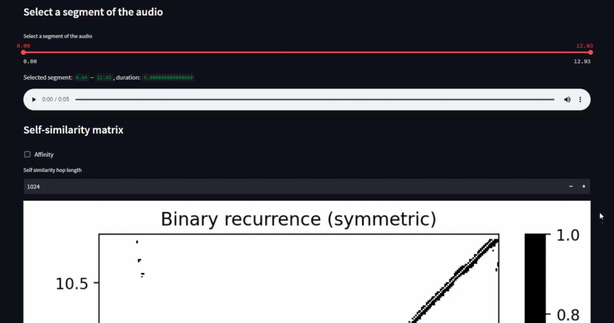
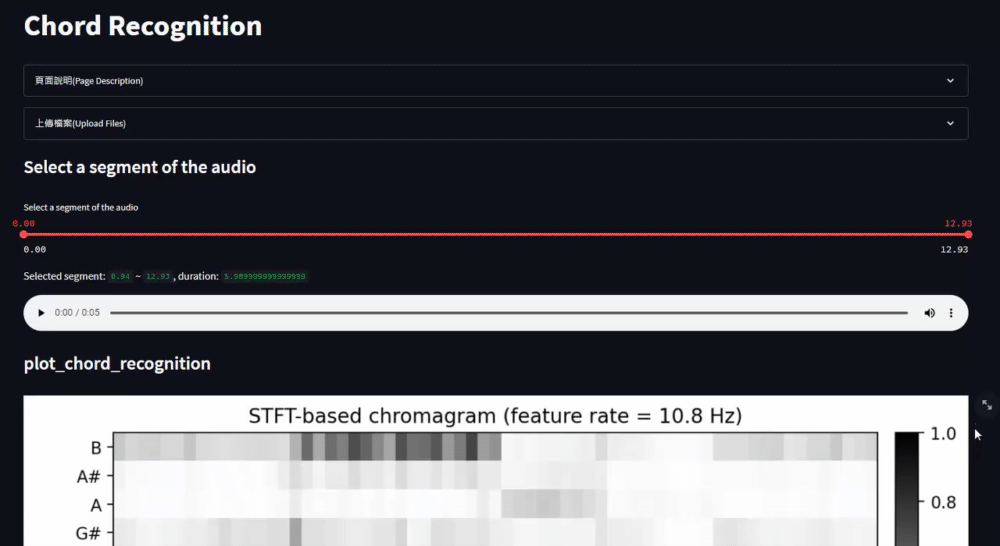
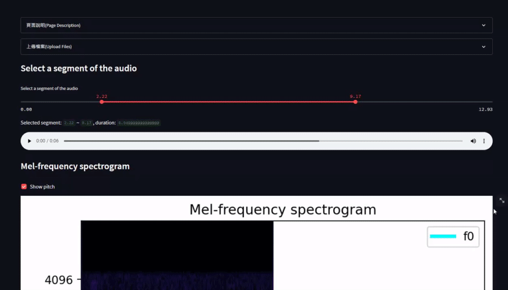
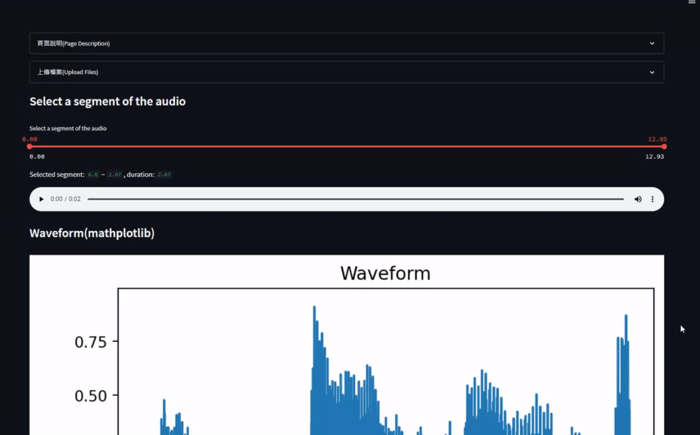

# music-analysis
音樂分析工具
## 程式
相關程式來源於[這裡](https://github.com/TrangDuLam/NTHU_Music_AI_Tools)。

## 安裝及執行方式

### 本地端執行
```sh
# 下載專案
git clone https://github.com/Keycatowo/music-analysis.git
cd music-analysis

# 安裝相關套件
pip install -r requirements.txt

# 執行
streamlit run home.py
```

### 網頁範例
[](https://nthu-music-tools.streamlit.app/)

## 範例


## 開發日誌
+ 2023/02/19：修正功能錯誤、改為tabs結構、新增部分操作功能
    + Part2: Chrome下載csv功能、12/120 Classes圖
    + Part3: Onset與Beats調整區塊
    + Part6：可調整rollof選項、下載Spectrogram的csv
+ 2023/02/04：完成part2、part3、poart4、part6功能
+ 2023/02/03：完成part1功能、完成part1使用說明
+ 2023/01/19：新增part6功能草稿、更新README安裝方式
+ 2023/01/03：新增part1, 3功能草稿
+ 2022/12/29：Windows下環境打包
+ 2022/12/20：拆分成多頁面組成結構
+ 2022/12/14：建立專案、新增檔案讀取、檔案基本資訊


## TODO
+ Feature：範例檔案功能
+ BUG：多頁面的拉杆在切換的時候顯示會不同步，但功能正常
+ Feature：包裝成Docker
+ Feature：部署到Vercel demo


## 版本記錄

### v0.7.0-alpha
+ 修正sample rate錯誤
+ 改為tabs結構
+ 新增部分操作功能
    + Part2: Chrome下載csv功能、12/120 Classes圖
    + Part3: Onset與Beats調整區塊
    + Part6：可調整rollof選項、下載Spectrogram的csv

### v0.6.1-alpha 整理發佈alpha版
+ 整理程式與README
+ 發佈alpha版程式

### v0.6.0-pre-alpha 加入Structure Analysis


### v0.5.0-pre-alpha 加入Timber Analysis


### v0.4.0-pre-alpha 加入Chord Recognition


### v0.3.0-pre-alpha 加入Beat Tracking


### v0.2.0-pre-alpha 加入Pitch Estimation


### v0.1.0-pre-alpha 加入Basic Information


### v0.0.1-pre-alpha 建立專案
