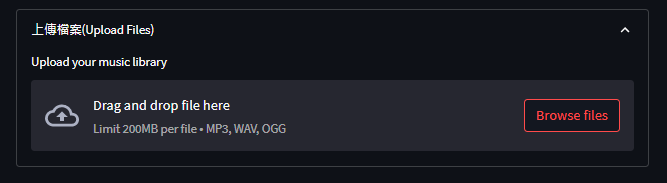
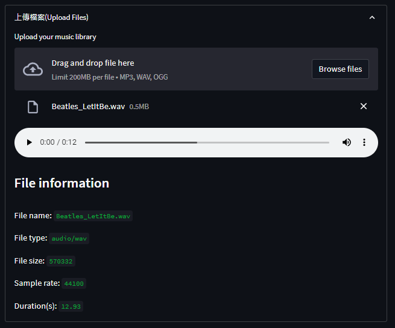
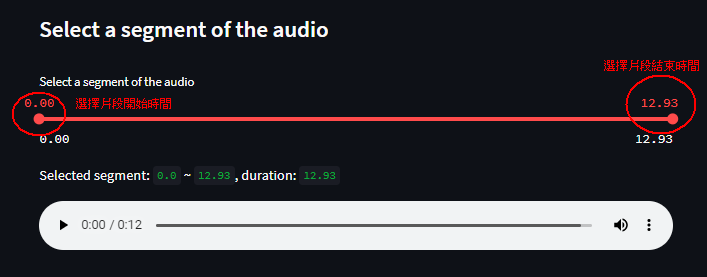
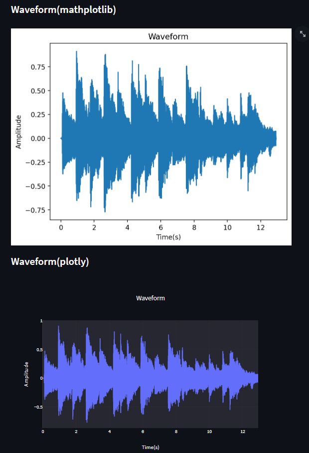
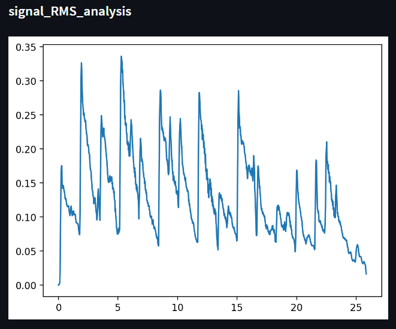
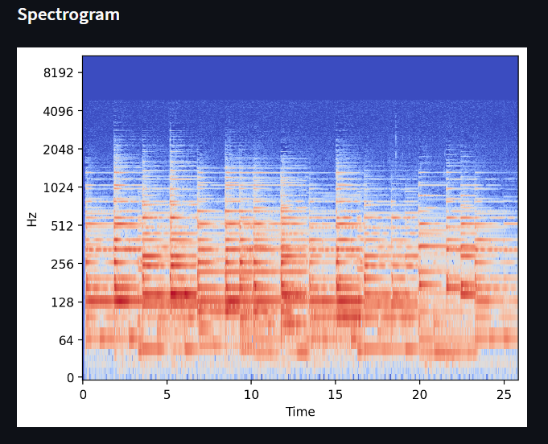
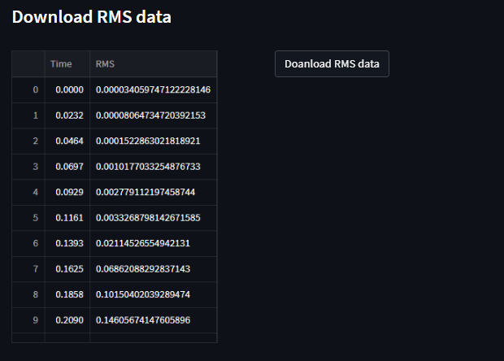

# Part1-Basic Information

## What can it do?
- Print audio length (seconds)
- Plot waveform
- Plot rms (librosa.feature.rms)
- Plot spectrogram
- Save rms as .csv

## How to use it?

### Step1：上傳音檔
在上傳音檔區塊，點選上傳音檔，選擇要分析的音檔，點選上傳。
> 上傳檔案限制：
> - 檔案大小：200MB
> - 檔案格式：`.mp3`, `.wav`, `.ocg`

上傳完成後，會顯示音檔的基本資訊，並提供一個播放介面檢查音檔是否正確。

### Step2：選擇要分析的片段
預設分析為整段音檔，若要分析音檔的特定片段，可以在此區塊選擇要分析的片段。
同樣的，選擇完後，會顯示音檔的基本資訊，並提供一個播放介面檢查音檔是否正確。

### Step3：前往要分析的功能

#### 聲音波形(waveform)

### 聲音強度(rms)

### 聲音頻譜(spectrogram)

### 儲存聲音強度(rms)

